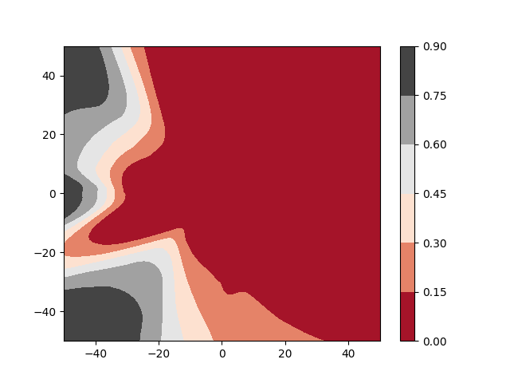
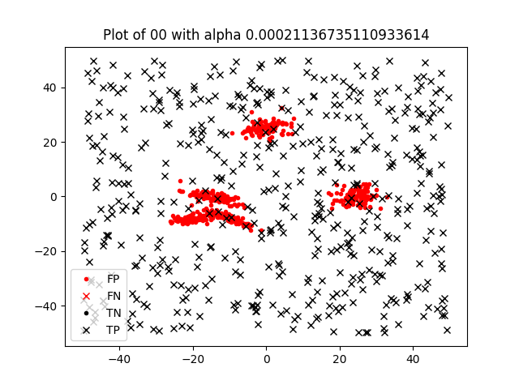
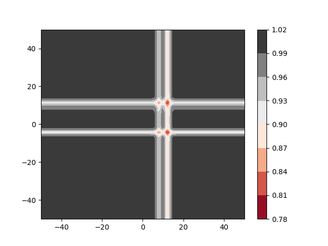
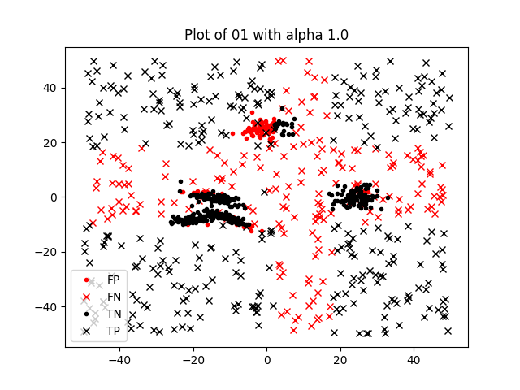
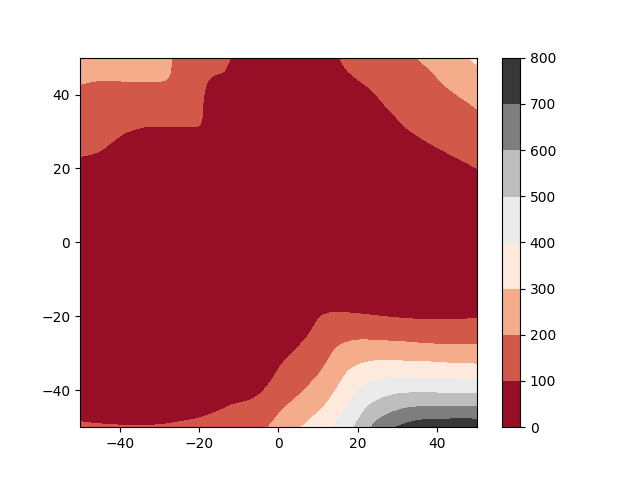
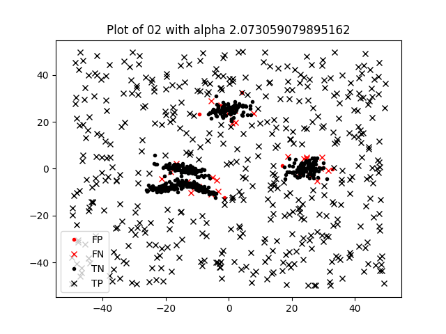
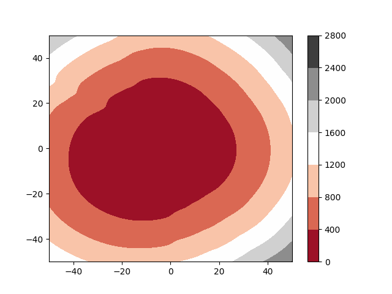
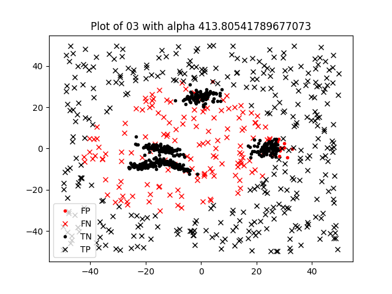
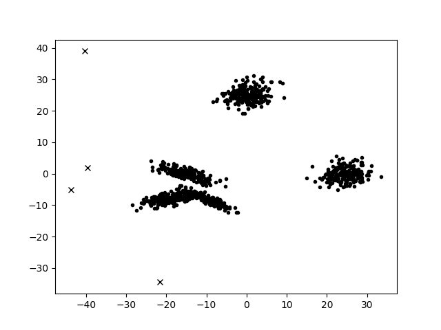
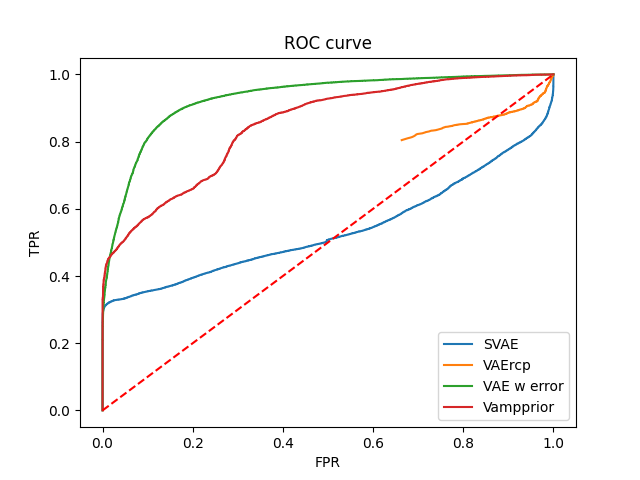

## SVAE
**Test result on unseen data:**
Average accuracy: 0.5934400000000001
Balanced acc: 0.59344
Average specificity: 1.0
Average sensitivity (Detection rate): 0.18688000000000002
Average loss: nan
Average False Alarm: 0.81312
Average F1: 0.3149096791588029
Average cm:
||True 0| True 1|
|-|-|-|
|Predicted 0|500.0|406.55999999999995
|Predicted 1|0.0|93.44

## VAE Reconstruction probability
**Test result on unseen data:**
Average accuracy: 0.61136
Balanced acc: 0.61136
Average specificity: 0.31744
Average sensitivity (Detection rate): 0.90528
Average loss: nan
Average False Alarm: 0.09471999999999998
Average F1: 0.6996413997774206
Average cm:
||True 0| True 1|
|-|-|-|
|Predicted 0|158.72|47.36
|Predicted 1|341.28000000000003|452.64000000000004

## VAE Reconstruction error
**Test result on unseen data:**
Average accuracy: 0.8856
Balanced acc: 0.8855999999999999
Average specificity: 0.8820399999999999
Average sensitivity (Detection rate): 0.88916
Average loss: nan
Average False Alarm: 0.11084
Average F1: 0.8860058192833513
Average cm:
||True 0| True 1|
|-|-|-|
|Predicted 0|441.02|55.42
|Predicted 1|58.980000000000004|444.58000000000004

## VAE with Vampprior
**Test result on unseen data:**
Average accuracy: 0.7980999999999999
Balanced acc: 0.7980999999999999
Average specificity: 0.7095199999999999
Average sensitivity (Detection rate): 0.8866799999999999
Average loss: nan
Average False Alarm: 0.11332
Average F1: 0.8145290194565398
Average cm:
||True 0| True 1|
|-|-|-|
|Predicted 0|354.76|56.660000000000004
|Predicted 1|145.23999999999998|443.34

## Training set

## ROC
